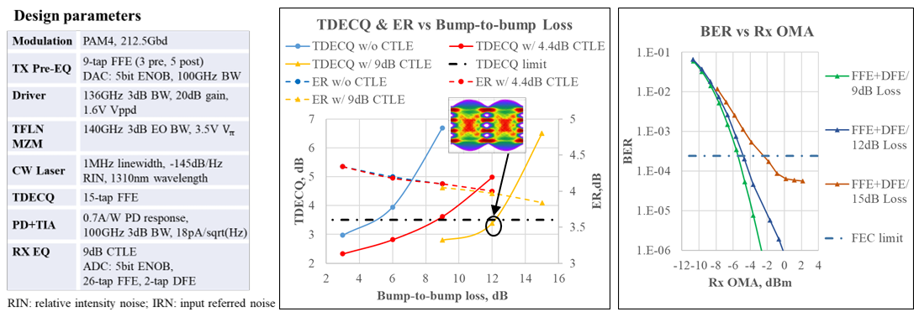

# Historical provisional CPO snapshot — 10 August 2026

**Status:** Historical private working snapshot. It is superseded for current decisions by the [Current CPO decision memo](current-decision-memo-2026-08-11.md), dated 12 August 2026. It is not a publication-ready conclusion or an investment conclusion.  
**Scope at the time:** 2026–2032; scale-out optical engines/PICs were the active workstream.  
**Current investment posture:** No public-equity recommendation is justified yet.

## Document control

This snapshot preserves the questions and scenario logic used on 10 August. It must not be read as evidence that deployment, volume, yield, supplier economics or a public-equity leader has since been proven. The current memo and the SKU-bound [NVIDIA dossier](../07-companies/commercial-proof-dossiers/nvidia-spectrum-x-photonics.md) and [Broadcom dossier](../07-companies/commercial-proof-dossiers/broadcom-th6-davisson.md) govern any current decision.

## Answer in the required format

| Question | Conclusion |
|---|---|
| **Architecture** | **Switch-side CPO at 200G/lane** has the strongest near-term commercial signal for Ethernet scale-out. Retimed/advanced pluggables remain the principal countercase; 200G LPO lacks a matched measured system, and 400G LPO remains component/model bounded. (`CLM-057`–`CLM-067`, `CLM-345`–`CLM-350`) |
| **Deployment domain** | **Ethernet scale-out switching** is the best-supported first domain. Inter-rack scale-up CPO has a stronger strategic rationale but is a separate product and supplier denominator. (`CLM-189`–`CLM-192`, `CLM-224`–`CLM-225`) |
| **Commercial-proof year and probability** | **Not eligible as a current forecast.** The former 2026/2027 priors remain scenario inputs only; they are not calibrated adoption probabilities and are superseded by the current verification-window framing. No retained public record yet joins exact SKU, named customer, accepted units/ports and repeat shipment. (`commercial-proof-probability-priors.md`; [current memo](current-decision-memo-2026-08-11.md)) |
| **Meaningful-adoption year and probability** | **Not numerically defensible from the public record.** A conditional **2028–2030 window** is the working scenario, but no percentage is assigned because the system denominator, accepted-unit numerator, matched TCO and service bundle are not public. (`CLM-074`, `CLM-077`, `CLM-082`, `CLM-084`) |
| **Critical-path milestones** | 1) named customer CPO SKU and accepted units; 2) repeat shipment/expansion; 3) final-engine yield waterfall; 4) qualification and field-service data; 5) matched CPO/LPO/NPO TCO; 6) supplier content, ASP and margin attribution. |
| **Technical leader** | **No overall technical leader established.** At most, the record identifies narrow disclosed control points: NVIDIA has the most specific integrated platform/manufacturing route; Broadcom has the clearest merchant 200G/lane product definition; TSMC is a process/stacking control point; Coherent has broad component routes; and Lumentum has an external-light order signal. These are not customer, volume, qualified-engine, profit or public-equity leadership findings. (`CLM-068`–`CLM-073`, `CLM-076`–`CLM-079`, `CLM-210`, `CLM-213`–`CLM-216`) |
| **Volume leader** | **No leader established.** “Production” announcements and limited-volume reports do not provide a reconciled CPO SKU, accepted-unit count or repeat shipment record. (`CLM-411`–`CLM-420`, `CLM-435`–`CLM-437`) |
| **Profit-pool leader** | **No leader established.** Coherent's stack breadth and Lumentum's component-order signals do not establish allocated product content, qualified-engine yield, supplier share, ASP, realised CPO margin or warranty burden. (`CLM-083`, `CLM-197`–`CLM-198`, `CLM-250`–`CLM-251`) |
| **Best public-equity opportunity** | **No decision / not yet investable.** CPO-specific earnings, valuation, cannibalisation, capex and downside are not attributable from the public record. |
| **Evidence quality** | Strong technical and process triangulation; weak customer-unit, final-yield, field-service and supplier-economics evidence. The academic packet is sufficient for architecture framing, not for a product-margin forecast. |

## Why this snapshot stopped here

The key technical boundary is shown below. It is deliberately presented as a source snapshot rather than a recreated chart.

The 12-dB/15-dB contrast is a model-specific architecture trigger, not proof that CPO wins at a universal loss number. The other retained snapshots—polymer stability, detachable-connector repeatability and a TGV optical-engine assembly—are linked in the [figure register](../11-figures/figure-register.md) and document the process mechanisms behind the conclusion without supplying the missing HVM-yield, field-service or margin data.

The technical record now covers the relevant engine mechanisms: detachable known-good-module testing and connector loss (`PAP-028`, `CLM-495`–`CLM-499`), 224G/lambda FOWLP packaging (`PAP-029`, `CLM-500`–`CLM-503`), high-power polymer-waveguide stability (`PAP-030`, `CLM-509`–`CLM-513`), 400-Gbps TGV-engine and replacement evidence (`PAP-044`, `CLM-504`–`CLM-508`), and advanced-pluggable/PIC counterexamples (`PAP-053`, `PAP-054`, `CLM-471`–`CLM-486`). These sources establish engineering boundaries but do not establish production economics.

The strongest positive signal then was the convergence of a 200G/lane switch-CPO product route, a named manufacturing ecosystem and first-adopter statements. The strongest counterevidence remains that advanced pluggable/PIC paths already demonstrate 400G-class components or transmission, so CPO must win on complete-system power, electrical reach, package density, qualification, serviceability and cost—not lane rate alone.

## Main disconfirming evidence

Downgrade the conclusion if named customers show repeat 200G/lane LPO or advanced-pluggable deployments at acceptable power and service cost; if CPO final-engine yield/rework remains materially worse after qualification; if production claims resolve to evaluation quantities or non-CPO SKUs; if supplier contracts show low-margin, price-down-heavy engine content; or if accelerator/inter-rack CPO captures the value pool while switch-side scale-out remains narrow.

## Next thesis-changing catalyst (still open)

The single highest-value catalyst is a customer- or platform-owner record identifying a production CPO SKU, accepted unit/port range, repeat shipment evidence and the supplier/content boundary. The next most valuable evidence is a final-engine yield waterfall with fibre attach, test/rework, qualification and warranty allocation. Until those appear, the correct conclusion is **strongest timing signal, no proven volume leader, no proven profit-pool leader, and no public-equity decision**.

## Evidence controls

- [Current decision memo](current-decision-memo-2026-08-11.md)
- [Commercial-proof probability priors](../08-model/commercial-proof-probability-priors.md)
- [Public-data boundary register](../08-model/public-data-boundary-register.md)
- [Decision-output completion audit](../08-model/decision-output-completion-audit.md)
- [Claim ledger](../01-sources/claim-ledger.csv)
